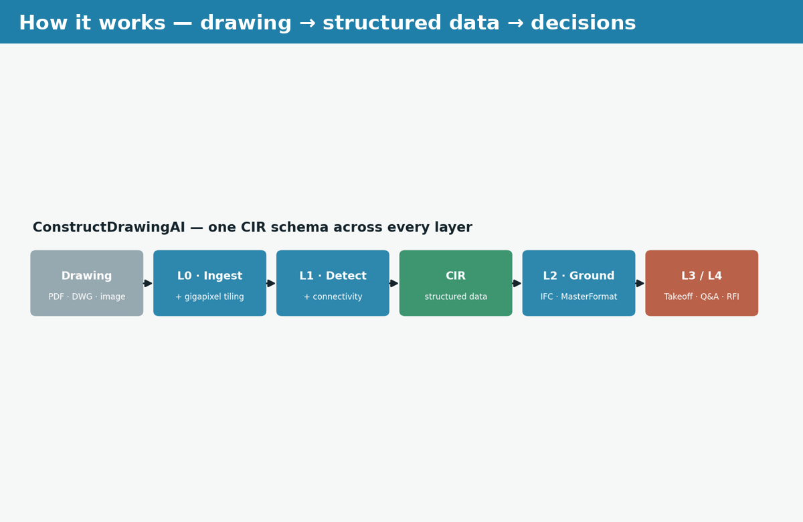
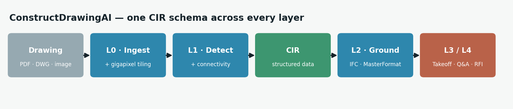
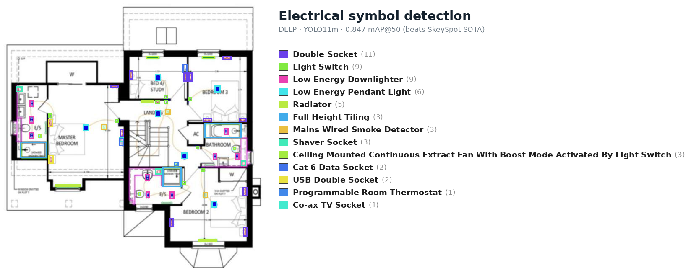
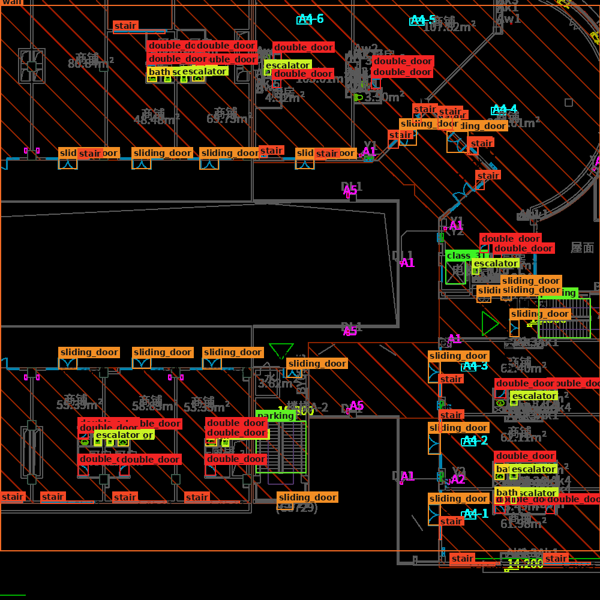
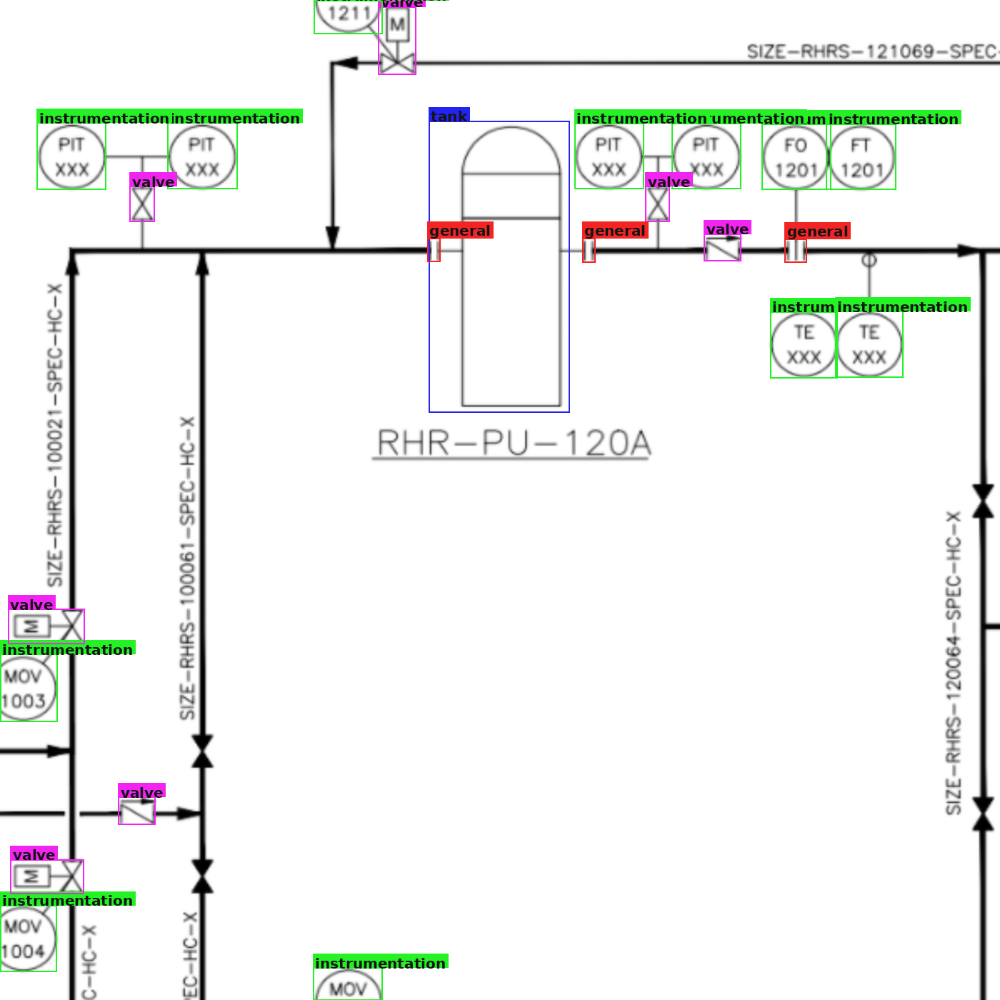
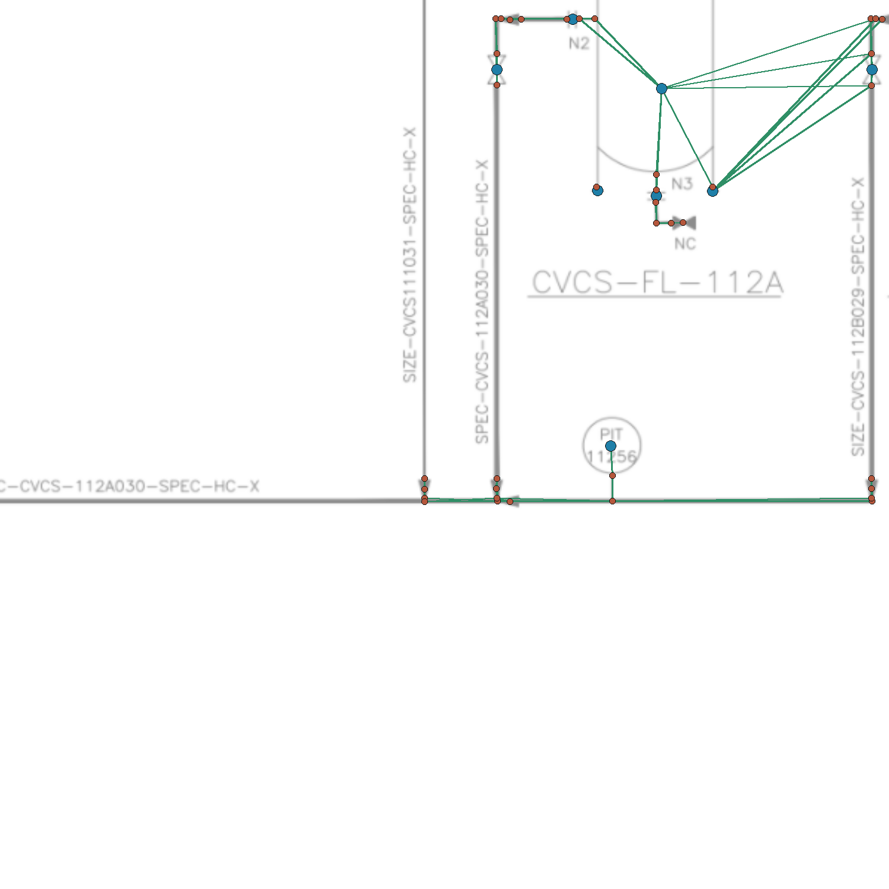
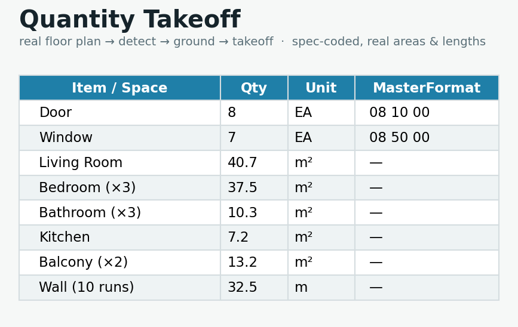

# ConstructDrawingAI

**Read 2D construction drawings and turn them into structured, decision-ready data** — symbol
and component detection, connectivity graphs, quantity takeoff, natural-language Q&A, and RFI
drafts — across electrical, architectural, and P&ID disciplines, with results measured on real
drawings against published state of the art.



---

## Results (real, held-out test splits)

| Capability | Benchmark | Result | State of the art |
|---|---|---|---|
| Electrical detection | DELP / SkeySpot (official split) | **0.847 ± 0.024** mAP@50 | SkeySpot 0.825 |
| Architectural detection | FloorPlanCAD (35 classes) | **0.820 ± 0.005** mAP@50 | — |
| Architectural (official split) | CubiCasa5K (9 classes) | **0.604 ± 0.001** mAP@50 | — |
| P&ID detection | PID2Graph OPEN100 (6 symbols) | **0.926 ± 0.008** mAP@50 | — |
| Connectivity (end-to-end) | PID2Graph OPEN100 edges | **0.752** edge AP | Relationformer 0.755 |

All numbers are 3-seed means ± std on held-out real test splits. Full methodology, splits, and
references: [`docs/BENCHMARKS.md`](docs/BENCHMARKS.md).

---

## How it works



A drawing flows through five layers, all reading and writing **one schema** — the Canonical
Intermediate Representation (CIR):

- **L0 · Ingest** — PDF / DWG-DXF / IFC / image → gigapixel tiling → CIR
- **L1 · Perception** — symbol/component detection + connectivity-graph extraction
- **L2 · Grounding** — map detections to IFC classes + MasterFormat / UniFormat codes
- **L3 · Engines** — quantity takeoff (counts, areas, lengths)
- **L4 · Agent** — natural-language Q&A and RFI drafting over the CIR

Every extracted value carries a confidence score and a link back to its source entity + sheet.

---

## Gallery

**Symbol & component detection** — trained detectors on real drawings:

| Electrical | Architectural | P&ID |
|---|---|---|
|  |  |  |

**Connectivity graph** (P&ID — symbols + junctions + pipe/signal edges) and **quantity takeoff**
(from a real floor plan — real areas, counts, spec codes):

| Connectivity extraction | Quantity takeoff |
|---|---|
|  |  |

---

## Architecture

| Layer | Directory | Role |
|---|---|---|
| CIR schema | [`cir/`](cir/) | shared schema + (de)serialization |
| L0 ingestion + tiling | [`ingest/`](ingest/) | PDF / DXF / IFC / image → CIR |
| L1 perception | [`perception/`](perception/) | detection + connectivity ([`docs/PERCEPTION.md`](docs/PERCEPTION.md)) |
| L2 grounding | [`grounding/`](grounding/) | IFC + MasterFormat / UniFormat codes |
| L3 engines | [`engines/`](engines/) | quantity takeoff |
| L4 agent | [`agent/`](agent/) | Q&A + RFI over the CIR |
| Evaluation | [`eval/`](eval/) | metrics, multi-seed CIs, cited SOTA baselines |
| Synthetic engine | [`synthetic/`](synthetic/) | IFC / parametric → rendered drawings |
| Backend API | [`backend/`](backend/) | FastAPI service + demo console over the CIR |

See [`docs/ARCHITECTURE.md`](docs/ARCHITECTURE.md) and [`docs/CIR.md`](docs/CIR.md).

---

## Quickstart

Requires **Python ≥ 3.11** and [**uv**](https://docs.astral.sh/uv/).

```bash
uv sync --extra dev --extra eval --extra perception --extra backend

uv run pytest -q                                   # test suite

# Quantity takeoff from a CIR document (counts + areas + lengths, spec-coded)
uv run python -m engines.takeoff --cir <file.cir> --format md

# Backend API + demo console (paste a CIR, run takeoff / Q&A / RFI)
uv run uvicorn backend.app:app --reload            # http://127.0.0.1:8000
```

The API also serves `POST /takeoff-from-image` (upload a drawing → detect → takeoff) and
`POST /qa`, `POST /rfi`. Point it at trained weights with
`CDAI_DETECTOR_WEIGHTS='{"architectural": "<path>/best.pt"}'`.

---

## Datasets & licenses

Benchmarks use publicly available datasets under their own licenses (attribution retained):
**DELP** (CC-BY), **FloorPlanCAD** (CC-BY-NC), **CubiCasa5K** (CC-BY-NC), **PID2Graph** (CC-BY-SA),
**ResPlan** (MIT). Data is versioned with DVC / kept local — never committed to git. See
[`datasets/registry.yaml`](datasets/registry.yaml).

## Roadmap

Structural and civil disciplines (pending real detection data), combined-dataset training for
cross-domain robustness, and expanded synthetic pretraining.

## License

Free for **noncommercial research and education** under the
[PolyForm Noncommercial License 1.0.0](LICENSE). **Commercial use requires a separate license** —
contact Alireza Shojaei (shojaei@vt.edu). Datasets and model weights remain under their upstream
licenses.
